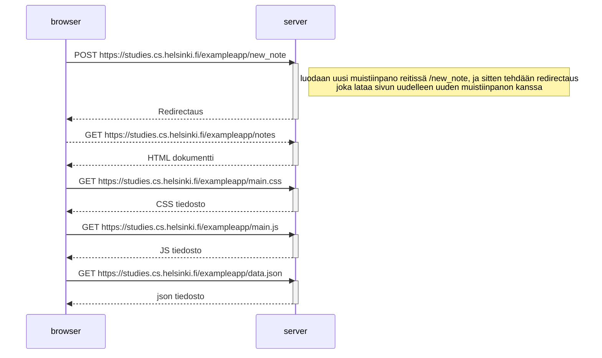

```mermaid
sequenceDiagram
  participant browser
  participant server

  browser->>server: POST https://studies.cs.helsinki.fi/exampleapp/new_note
  activate server

  Note right of server: luodaan uusi muistiinpano reitissä /new_note, ja sitten tehdään redirectaus <br>joka lataa sivun uudelleen uuden muistiinpanon kanssa

  server-->>browser: Redirectaus
  deactivate server

  browser-->>server: GET https://studies.cs.helsinki.fi/exampleapp/notes
  activate server
  server-->>browser: HTML dokumentti
  deactivate server

  browser->>server: GET https://studies.cs.helsinki.fi/exampleapp/main.css
  activate server
  server-->>browser: CSS tiedosto
  deactivate server

  browser->>server: GET https://studies.cs.helsinki.fi/exampleapp/main.js
  activate server
  server-->>browser: JS tiedosto
  deactivate server

  browser->>server: GET https://studies.cs.helsinki.fi/exampleapp/data.json
  activate server
  server-->>browser: json tiedosto
  deactivate server

```
